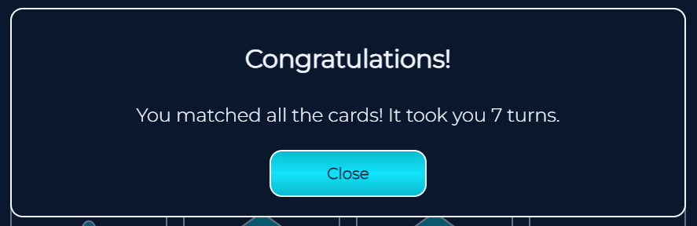
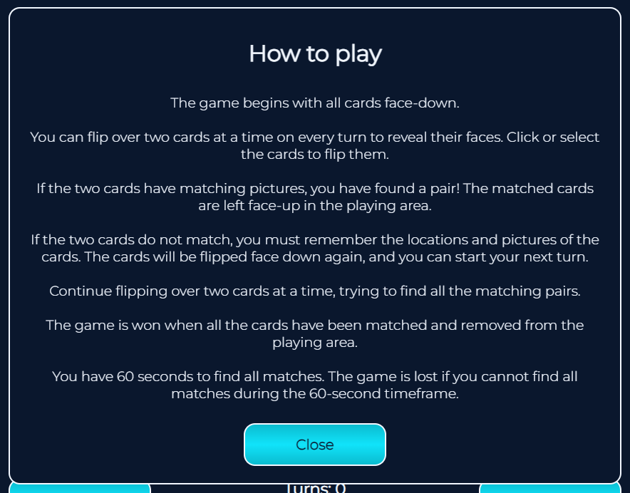

# Geomemo

Geomemo is a memory card game. The site targets users who look for moments of distraction from their usual day. 
Playing the game will give the user moments of playfulness and help enhance their memory.

You can find the live site here.

## User Experience (UX)

### User Stories

- As a user, I want to play a quick game of memory.
- As a user, I want to be able to access to rules of the game.
- As a user, I want to see how many turns it took me to win the game.

## Design

### Colour scheme

### Typography

“Montserrat” is the font used for this website, with a sans serif as a fallback. The font is simple and provides good readability.

### Visuals

The memory cards use consistent symbols as well as the card back. Overall, the page looks consistent and makes the user want to play a round of memory.

### Wireframes

All wireframes were designed for laptop/desktop, iPad/tablet, and phone screens.

[Wireframe for desktop](assets/images/readme/wireframe-desktop.png)  
[Wireframe for tablet/ipad](assets/images/readme/wireframe-tablet.png)  
[Wireframe for phone/iphone](assets/images/readme/wireframe%20-%20phone.png)

## Features

### Current features

- Header  
The header shows the game’s name and gives the user information about the type of game.

- Game area  
The game area shows the 12 memory cards.

- "Win” overlay  
When the game is won, the win overlay appears and tells the user how many turns it took to win.

- “Lose” overlay  
When the timer runs out, the overlay tells the user they are out of time.

- Information area  
The information area consists of the “How to play” button, information about turns and the timer, and the “Restart” button.

- “How to play” button  
It opens up information about the rules of the game.

- Turns and timer  
The turns counter counts the turns that the player has already done.
 The timer counts down from 60 seconds. If the game is not resolved in 60 seconds, the player loses the game.

 

 - “Restart” button  
The restart button restarts the game (the turn counter is set to 0, and the timer is set to 60 seconds).

### Future features

- There could be different levels of the game. For example, the “easy” level could use 12 memory cards, the “medium” level could use 16 cards, and the “hard” level could use 20 cards.
- A scoreboard could be implemented so that the user could keep track of their best results.

## Technologies used

### Languages used

- HTML
- CSS
- JavaScript

### Frameworks, Libraries and Programs Used

- [Google Fonts](https://fonts.google.com/) used to import “Montserrat” font.
- [GitHub](https://github.com/) is used to host the repository.
- [Gitpod](https://gitpod.io/) was used to develop the project and organise version control.
- [GitHub Pages](https://pages.github.com/) are used to deploy the site.
- [Adobe XD](https://helpx.adobe.com/de/support/xd.html) was used to create wireframes.
- [Lighthouse](https://developer.chrome.com/docs/lighthouse/overview/) for performance review.
- [PowerMapper](https://www.powermapper.com/) was used to check compatibility with older browsers.
- [Responsinator](http://www.responsinator.com/) used to check that the site was responsive on different screen sizes.

## Testing

### Validating

- HTML – [HTML validator](https://validator.w3.org/nu/) – no errors or warnings found.

- CSS – [CSS validator](https://jigsaw.w3.org/css-validator/) – no errors or warnings found.

 
- JavaScript – [JShint](https://jshint.com/) – 

### Testing User Stories from UX Section

- As a user, I want to play a quick game of memory.
  - The user can play a short game on all screen sizes.
- As a user, I want to be able to access to rules of the game.
  - The user can access the game instruction by clicking the “How to play” button.
- As a user, I want to see how many turns it took me to win the game.
  - The user can see how many turns they have already done and get a message about their total turns when they win.

### Further Testing

#### Personal Testing

Through devices that are readily available to me, I was able to test the page on:

- iPhone SE – Safari
- iPad mini – Safari
- MacBook – Safari
- Windows laptop – Google Chrome
- Windows laptop – Microsoft Edge
- Windows laptop – Mozilla Firefox

#### Responsinator

Responsinator ensured the website was responsive on all devices and browsers.

#### Third-party Testing

I asked a few people to test the website on various devices. Their feedback was incorporated into the latest version.

#### Lighthouse

Lighthouse was used to see if there were issues with the performance of the website.

#### PowerMapper

PowerMapper was used to check the website for compatibility across different browsers.