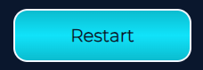

# Geomemo

Geomemo is a memory card game. The site targets users who look for moments of distraction from their usual day. 
Playing the game will give the user moments of playfulness and help enhance their memory.

You can find the live site here.

## User Experience (UX)

### User Stories

- As a user, I want to play a quick game of memory.
- As a user, I want to be able to access to rules of the game.
- As a user, I want to see how many turns it took me to win the game.

## Design

### Colour scheme

### Typography

“Montserrat” is the font used for this website, with a sans serif as a fallback. The font is simple and provides good readability.

### Visuals

The memory cards use consistent symbols as well as the card back. Overall, the page looks consistent and makes the user want to play a round of memory.

### Wireframes

All wireframes were designed for laptop/desktop, iPad/tablet, and phone screens.

[Wireframe for desktop](assets/images/readme/wireframe-desktop.png)  
[Wireframe for tablet/ipad](assets/images/readme/wireframe-tablet.png)  
[Wireframe for phone/iphone](assets/images/readme/wireframe%20-%20phone.png)

## Features

### Current features

- Header  
The header shows the game’s name and gives the user information about the type of game.

- Game area  
The game area shows the 12 memory cards.

- "Win” overlay  
When the game is won, the win overlay appears and tells the user how many turns it took to win.

- “Lose” overlay  
When the timer runs out, the overlay tells the user they are out of time.

- Information area  
The information area consists of the “How to play” button, information about turns and the timer, and the “Restart” button.

- “How to play” button  
It opens up information about the rules of the game.

- Turns and timer  
The turns counter counts the turns that the player has already done.
 The timer counts down from 60 seconds. If the game is not resolved in 60 seconds, the player loses the game.

 

 - “Restart” button  
The restart button restarts the game (the turn counter is set to 0, and the timer is set to 60 seconds).

### Future features

- There could be different levels of the game. For example, the “easy” level could use 12 memory cards, the “medium” level could use 16 cards, and the “hard” level could use 20 cards.
- A scoreboard could be implemented so that the user could keep track of their best results.

